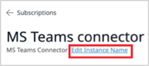
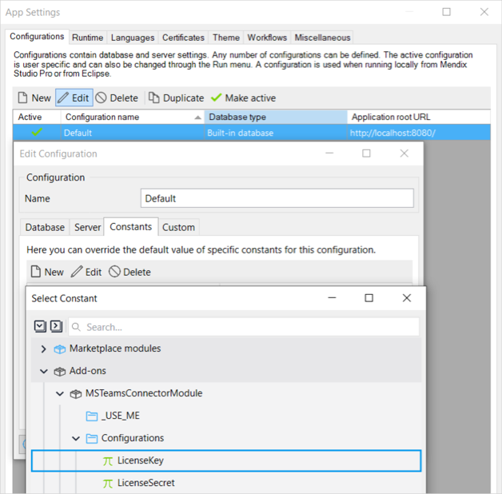
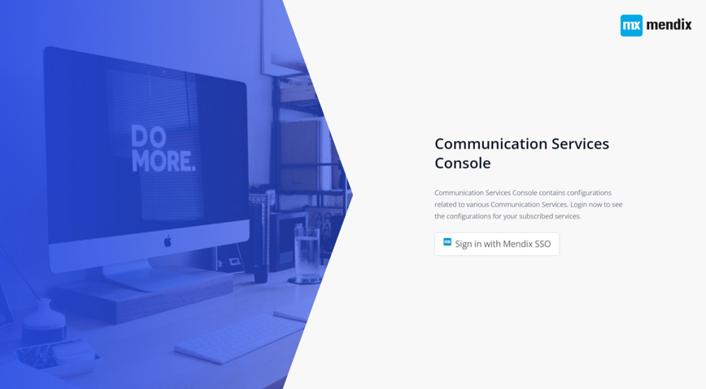
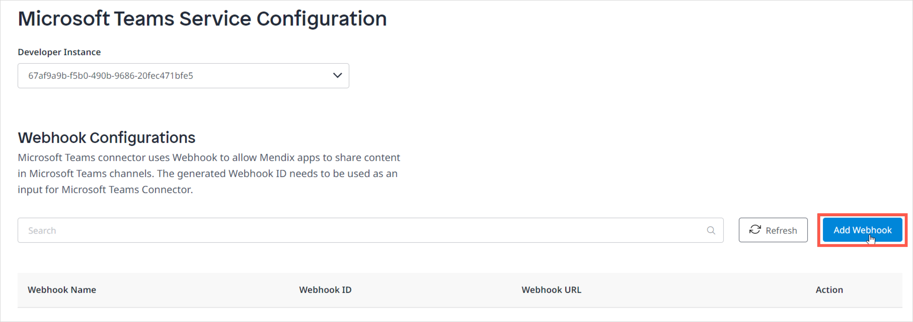
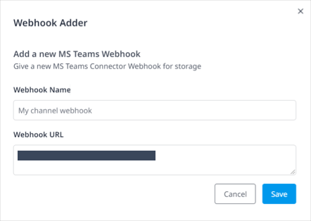
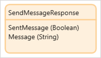
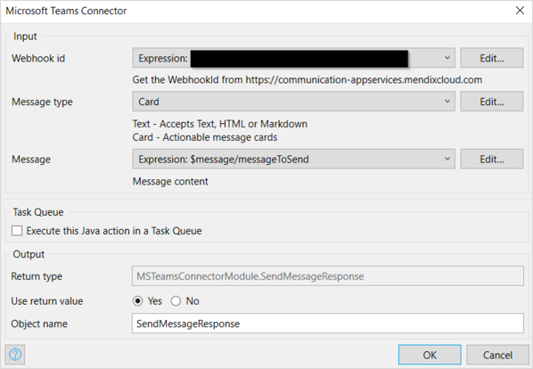

## 1 Introduction

{}[**Verify Marketplace Docs tabs**]{}

The [Microsoft Teams Connector](https://marketplace.mendix.com/link/component/118391) app service enables sending messages to a Microsoft Teams channel automatically. You can add and configure the app service in a microflow. Once the microflow that uses the app service is triggered, your app asynchronously sends out the message to the Microsoft Teams channel. 

This app service is an add-on module. For more information, see Add-On Module].

{}[Add a link to the Add-On Moduke doc. Path: /refguide/add-on-module]{}

### 1.1 Typical Use Cases

* Send messages to pre-configured channels in Microsoft Teams

* Let your Mendix app send automated notifications to pre-configured channels, when events occur in your Mendix application (example : your Mendix app can automatically send a message to a pre-configured channel whenever a ticket is raised on the support portal application)

* Let your Mendix app send automated messages to a pre-configured channel to trigger users to perform an action (example: your Mendix app can automatically ask users to create a Jira ticket by sending them a message in a pre-configured channel)

### 1.2 Limitations

* Currently, only text messages are supported

### 1.3 Prerequisites

* Your organization should allow you to use Webhooks in Microsoft Teams
* The app service can only be used with Studio Pro 9 versions starting from [9.8](https://docs.mendix.com/releasenotes/studio-pro/9.8)

## 2 Installation

1. Go to the Marketplace and download the file *MSTeamsConnectorModule.mxmodule* for the [Microsoft Teams Connector](https://marketplace.mendix.com/link/component/118391).
2.  To add the Microsoft Teams Connector to your app in Mendix Studio Pro, follow these steps:
    1. On the menu bar, go to **App** > **Show App Directory in Explorer**.
    2.  Check if a folder with the name **modules** is present in the directory. If not present, create a new folder with this name.

        
        
    3.  Copy the downloaded file *MSTeamsConnectorModule.mxmodule* into the **modules** folder. 
       
        {}The app cannot contain different versions of the Microsoft Teams Connector at the same time.{}

    4. In Studio Pro, go to **App** > **Synchronize App Directory**. 

After the synchronization is finished, you can find the app service in the **Add-ons** folder in the **App Explorer** and in the **Communication Services** category in the **Toolbox**.

## 3 Configuration

Microsoft Teams Connector is a premium Mendix product that is subject to a purchase and subscription fee. To successfully deploy an app that uses Microsoft Teams Connector, you need to get a valid combination of **LicenseSecret** and **LicenseKey** and configure them as environment variables in the deployment setting.

### 3.1  Subscribing to Get LicenseSecret and LicenseKey {#key-generation}

1. On the [Microsoft Teams Connector](https://marketplace.mendix.com/link/component/118391) page, click **Subscribe** to start a subscription or click **Try for Free** to start a trial.

2.  To start a subscription, fill in [Technical Contact](https://docs.mendix.com/developerportal/collaborate/app-roles#technical-contact) information (**First Name**, **Last Name**, **Email Address**), billing account information, and other required information and then place the order. The Technical Contact receives an order confirmation email. 

    For the trial, you do not need to fill in this information.

3. Click the link in the order confirmation email to go to the Marketplace [Subscriptions](/appstore/general/app-store-overview#subscriptions) page and log in there. The **Subscriptions** page gives an overview of all the subscriptions of your organization.

4. Click **Microsoft Teams Connector** to open the [service management dashboard](/appstore/general/app-store-overview#service-management-dashboard).

5. Click **Create Binding Keys**.

6. Enter a meaningful name for the binding keys. Make sure that the name includes the name of the app which uses Microsoft Teams Connector.

7.  Click **Create Keys** to generate the **LicenseSecret** and **LicenseKey**. 

    

8. **Copy** the **LicenseSecret** and **LicenseKey**. You will use them later for app deployment.

{}We recommend that you **Edit Instance Name** for your subscription on the service management dashboard. This is a good practice if you have purchased multiple subscriptions of a service.{}

### 3.2 Configuring LicenseSecret and LicenseKey for App Deployment

1. In the **App Explorer**, go to **Settings**. The **App Settings** dialog box opens. 
2. On the **Configurations**, click **Edit**. The **Edit Configuration** dialog box opens.
3. Go to the **Constants** tab.
4. Click **New**. The **Select Constant** dialog box opens.
5.  Go to **MSTeamsConnectorModule** > **Configurations**. You can see **LicenseSecret** and **LicenseKey** are defined as constants. 

    
    
6. Select **LicenseSecret**.
7. In the **New Constant Value** dialog box, enter the **Value** of the LicenseSecret you got.
8. Click **OK** to save the settings and closes the dialog box.
9. Perform steps 4 and 5 again.
10. Select **LicenseKey**.
11. In the **New Constant Value** dialog box, enter the **Value** of the LicenseKey you got.
12. Click **OK** to save the settings and closes the dialog box.
13. After you finish building the app, click **Run** to deploy your app to the cloud.

## 4 Usage

### 4.1 Configuring Webhooks in the Communication Services Console

1. In Microsoft Teams, [create a Webhook URL for the channel](https://docs.servicenow.com/bundle/quebec-it-service-management/page/product/site-reliability-ops/task/create-webhook-url-channel-ms-teams.html) to which you want to send messages. 
2. Go to the Marketplace [Subscriptions](/appstore/general/app-store-overview#subscriptions) page and log in there.
3. Click **Microsoft Teams Connector** to open the service management dashboard.
4.  Click **Manage Instances**.
    {}Provide image when available{} 
    
    You are redirected to the **Communication Services Console** login page.
    
5.  Sign in to **Communication Services Console** using Mendix SSO.
    
    
    
    The **Communication Services Console** shows all the communication services that you have subscribed.

6.  Go to the **Microsoft Teams Connector** tab. 
7.  Select the **Developer Instance** from the drop-down list against which you want to configure **Webhook URLs**. The **Add Webhook** button gets enabled.

    

8.  Click **Add Webhook**. The **Webhook Adder** dialog box opens. 
   
    
    
9. Enter a **Webhook Name** for the Webhook.
10. Enter the **Webhook URL** which you configured for your Microsoft Teams Channel.
11.  **Save** the changes. The Webhook is added to the list.

     
     The system automatically generates a unique **Webhook ID** for each **Webhook URL** you add. You will need to give **Webhook ID** as input to the **Microsoft Teams Connector** activity to send messages. 
     
     {}Each **Webhook URL** you add is counted as utilization towards the allocated app service quota. If a **Webhook URL** is incorrect, you can edit or delete the Webhook.{}     
    
12.  Copy the **Webhook ID** as follows:
     1.  Hover over the **...** icon in the **Action** column to open the pop-up menu.
        
          
         
     2.  Click **Copy**. A pop-up window opens and shows the name of the Webhook that you have copied.
        
         
        
         {}You can select **Edit** or **Delete** to edit or delete a Webhook.
         {}

### 4.2 Sending Message to a Teams Channel

#### 4.2.1 Using Microflow
1.  You can use the Microsoft Teams Connector in a microflow to send plain text messages. The Microsoft Teams Connector module comes with predefined entity **SendMessageResponse** whose object will be returned as a response from Microsoft Teams Connector activity.
       

2.  From the toolbox, drag and drop the **Microsoft Teams Connector** activity into your microflow. 
     This representative microflow contains activities with the required attributes, Microsoft Teams Connector activity and a placeholder to capture the returned object.
     
   
3.  Double-click the **Microsoft Teams Connector** activity to open the **Microsoft Teams Connector** dialog box.
4.  Specify the following settings with expression syntax:
    1.  Set the **webhookId** parameter to the **Webhook ID** generated in the Communication Services Console.
    2.  Set the **textMessage** parameter to the message you want to send to the Microsoft Teams channel.
      
        
        
    3. Click **OK** to save the changes and close the dialog box.

5. After the **Microsoft Teams Connector** activity is configured, once the microflow that uses this activity is triggered, the app asynchronously sends out the message to the Microsoft Teams channel. When the message is sent successfully, the activity returns a SendMessageReponse object.
6. This object will contain SentMessage field as true when the message is successfully sent otherwise false.The Message attribute in object will contain the respective response message.

## 5 Checking Statistics Using the Usage Dashboard {#statistics}

The **Usage** dashboard shows the real-time statistics about the usage of an app service. For the Microsoft Teams connector, perform the following steps to check the number of Microsoft Teams webhooks usage:

1. Log into the Marketplace.
2. Go to **My Marketplace** and click [Subscriptions](/appstore/general/app-store-overview#subscriptions) on the left navigation menu. The **Subscriptions** page gives an overview of all the subscriptions of your organization.
3. Click on **Usage Dashboard** corresponding to **Microsoft Teams connector** to open the **Usage** dashboard. It shows the following statistics:
   * **This Month** – Shows usage statistics for the current month
   * **Last Month** – Shows usage statistics for last month
   * **Total** – Shows usage statistics from the start of the subscription date to today

## 6 Troubleshooting

When you get the following pop-up window, then your license is invalid. Check if the configuration of your [LicenseSecret and LicenseKey](#key-generation) is correct.

When you get the following pop-up window, then your quota is used up. You can check your usage statistics on the [Usage dashboard](#statistics).

