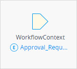
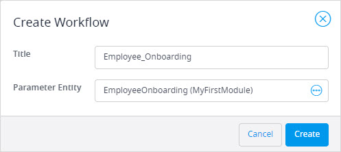
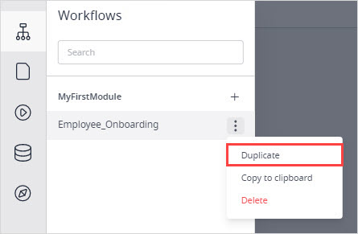
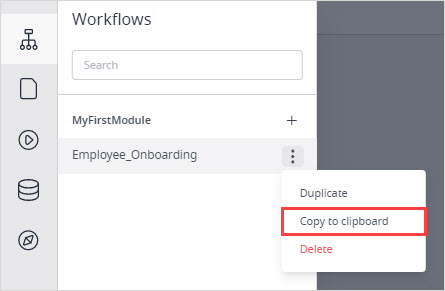

## 1 Introduction

Workflow is a visual language in Mendix Studio and Mendix Studio Pro that allows you to to solve your business problems that involve processes. It is fully integrated with other visual languages, such as the microflow editor and page editor. 

The main difference between workflows and [microflows](microflows) is a waiting aspect – the workflow is paused until it gets an input from an end-user. For example, an employee sends a travel request (triggering the start of the workflow) and then the workflow is paused until a manager approves the request by clicking a button. 

To view the workflows of your app in Studio, click the **Workflows** icon in the left menu bar:

Workflows are a visual way of processing logic in your application. A workflow looks like a flow chart. On a new workflow a *start event* (a starting point of the workflow) and an *end event* (an endpoint of the workflow) are created by default. You can add various activities to a flow of a workflow that is called a *path*.

{}
Workflows are GA and available in Studio from **Mendix version 9.11**. If you have an app with workflow functionality below this version, this app is likely to be created in Studio Pro and requires a manual migration. For more information on how to migrate your app using Studio Pro, see [Migrate Workflow Apps](/refguide/workflow-beta-migration). 
{}

## 2 Workflow App Template

You can use workflow-specific app templates as a starting point for using workflows. For example, you can configure an approval request form for end-users based on which the app is be created. It contains preconfigured elements, such as dashboards, admin pages, dashboards, and a workflow that you can afterwards customize even more. You can discover these templates when creating a new app.

## 3 Workflow Context Parameter

A [workflow parameter](workflow-parameter) is input data for your workflow. The **WorkflowContext** parameter represents a business-related data that travels through the workflow:

For more information, see [Workflow Context Parameter](workflow-parameter). 

## 4 Performing Basic Functions

You can perform the following basic functions when working on workflows:

* [Open a workflow](#open)
* [Create a workflow](#create)
* [Duplicate a workflow](#duplicate)
* [Copy and paste a workflow](#copy-paste)
* [Delete a workflow](#delete)
* [Add elements to a workflow](#add-elements)

### 4.1 Opening a Workflow {#open}

To open a workflow in Studio, do the following:

1. Click the workflow icon in the left menu bar.

2. In the displayed list of workflows, select the one you want to open and click it:

The selected workflow is opened.

### 4.2 Adding a Workflow {#create}

There are two ways to create a workflow: you [use a wizard](#wizard) or [set the workflow up manually](#manual). 

#### 4.2.1 Creating a Workflow Using the Wizard {#wizard}

The wizard helps you create the Approval Request workflow. If your workflow falls under the approval request use case, for example, approving vacation days for your employees, this is a good starting point that sets the whole app automatically for you, not only the workflow itself but also pages and navigation. 

To create the workflow for the vacation approval via the wizard, do the following:

1. Click the workflow icon in the left menu bar.

2. Select the module you would like to add a new workflow to and click the plus icon next to this module:

    
    
    For more information on what modules are, see [Domain Model](domain-models).
    
3. In the **Create Workflow** dialog box, set the workflow title to **Vacation Approval** and click **Start Wizard**.

4. In the **Create Request Form**, click **Add Field**. 

5. You can now define input fields that will be used by a person submitting the request. For example, an employee who wants to submit vacation days will fill in their name, department, and desired dates of the vacation. Do the following:

    1. Fill in *Name* in the **Label** option, leave the **Type** as string, and mark this field as required. On the right you can see the preview of the future form.
    2. Click the plus icon to add more fields. 
    3. Follow steps 1-2 to add the *Department* of type string, *Start Date* of type Date and Time, and *End Date* of type Date and Time. 
    4. Click the **Create** button.
    
6. Based on this form the app is set up: labels that you filled in are turned into attributes of an entity used by the workflows, workflow and pages are created, security is set up. Click **Take the tour** to get more information about your app.

The app with the workflow is set up.

#### 4.2.2 Creating a Workflow Manually {#manual}

If your use case does not fall under an approval request, then you might want to set your workflow manually instead of using the wizard. Follow the steps below:

To add a workflow to your app in Studio, do the following:

1. Click the workflow icon in the left menu bar.

2. Select the module you would like to add a new workflow to and click the plus icon next to this module:

    
    
    For more information on what modules are, see [Domain Model](domain-models).

3. In the **Create Workflow** dialog box, fill in the workflow title and click **Set Up Manually**.

3. Click **Parameter Entity** and either select the existing entity or create a new one:

    
    
    For more information on the Workflow Context parameter and how it is used, see [Workflow Context Parameter](workflow-parameter).

4. Click **Create**.

The workflow is created. For a more information on how to configure the workflow manually, see [Configure a Workflow in Studio Manually](/studio-how-to/workflow-how-to-configure).

### 4.3 Duplicating a Workflow {#duplicate}

To duplicate a workflow, do the following:

1. Click the **Workflows** icon in the left menu bar.

2. In the side panel, click the ellipsis icon and select **Duplicate** in the drop-down menu:

    

The workflow is duplicated.

### 4.4 Copying and Pasting a Workflow {#copy-paste}

To copy and paste a workflow, do the following:

1. Click the **Workflows** icon in the left menu bar.

2. In the side panel, click the ellipsis icon and select **Copy to clipboard** in the drop-down menu:

    

3. Open the Studio app where you want to paste the workflow and press <kbd>Ctrl</kbd> +<kbd>V</kbd> or <kbd>Cmd</kbd> +<kbd>V</kbd>. 

Your workflow is pasted. For more information on copy/paste function in Studio, see the [Copy/Paste Workflows, Pages, Microflows, and Enumerations](general#copy-paste-documents) section in *General Info*. 

### 4.5 Deleting a Workflow {#delete}

To delete a workflow in Studio, do one of the following:

1. Open the workflow you want to delete and follow the steps below:
    1. Open the **Properties** tab.
    2. Click **Delete** at the bottom of the **Properties** tab.
2. Click the workflows icon in the left menu bar and do the following:
    1. In the side panel, click the ellipsis icon and select **Delete** in the drop-down menu:

The selected workflow is deleted. 

### 4.6 Adding Elements to a Workflow {#add-elements}

To add an element to a workflow, do the following:

1. Open the **Toolbox** tab.
2. Select an element you would like to add and drag and drop this element in the workflow path.

The selected element is added.

### 4.7 Triggering a Workflow

You can trigger a workflow [from a page](#trigger-page) or [via a microflow](#trigger-microflow). 

#### 4.7.1 Triggering a Workflow from a Page {#trigger-page}

To start the workflow, you can add a widget with a specific on-click action on a page. For more information on on-click actions, see [Events Section](page-editor-widgets-events-section).

Do the following:

1. Open a page from where you would like to trigger a workflow.
2. Drag and drop a widget that has on-click action in its properties (for example, a button) inside the data container with the workflow entity. 
4. Open button's properties > **Events** section. 
5. Set **On Click Action** to **More**.
6. Set **Action** to **Call Workflow**. 
7. Set **Workflow** to the workflow you would like to trigger.

You have configured the button to trigger the workflow.

#### 4.7.2 Triggering a Workflow via a Microflow {#trigger-microflow}

To trigger a workflow via a microflow, you can add a **Call workflow** activity to the microflow. For more information on this activity, see [Workflow Activities](microflows#microflow-workflow-activities) section in *Microflows*.  

Do the following:

1. Open a microflow that will trigger a workflow.
2. Make sure the microflow has a necessary parameter with the **Workflow Context** entity. 
3. In the **Toolbox**, find **Call workflow** activity and drag and drop it to the microflow.
4. Open the activity properties.
5. Set **Workflow** to to the workflow you would like to trigger.
6. Set **Workflow Object** to the workflow context.
7. Set **Workflow Name** for the variable, list, or object returned by this activity.

Now this microflow triggers the selected workflow:

## 5 Toolbox Elements

The **Toolbox** tab contains elements that you can drag and drop on a path. Below is a categorized overview of all elements. The following sections are used:

* [General](#general)
* [User actions](#user-actions)
* [System actions](#system)

### 5.1 General {#general}

Elements in the **General** section help you control the workflow path, for example, add parallel paths or end them:

The elements of this section are described in the table below:

| Element                                                      | Description                                                  |
| ------------------------------------------------------------ | ------------------------------------------------------------ |
| Start event                                               | The starting point of a workflow. Workflows are triggered either by the [Call workflow](page-editor-widgets-events-section#call-workflow) on-click event on pages or by the [Workflow call](microflows#microflow-workflow-activities) action in microflows.  Click the start event to open [workflow properties](workflow-properties). |
| [Decision](workflows-general-activities#decision)            | Makes a choice based on a condition and follows one and only one of the outgoing paths. |
| [Jump activity](workflows-general-activities#jump)           | Allows you to jump to other activities in the workflow.      |
| [Parallel split](workflows-general-activities#parallel-split) | Adds two or more parallel paths to your workflow.            |
| [End activity](workflows-general-activities#end)             | Ends the path of the workflow                                |

### 5.2 User Actions {#user-actions}

[User task](workflows-user-task) – a central element in a workflow that allows you to assign a task to a certain user or a group of users using filters or microflows. 

### 5.3 System Actions {#system}

[Call microflow](workflow-system-actions) activity calls a selected microflow. You can use this activity to add application logic to the path of the workflow that does not need user interaction. 

## 6 Main Documents in This Category

* [Workflow Context Parameter](workflow-parameter) – describes the Workflow Context parameter and its properties 
* [Workflow Properties](workflow-properties) – describes workflow properties 
* [User Task](workflows-user-task) – describes properties of a user task
* [Using Workflows in Apps with Mendix Version 9.6-9.10](workflows-9.6) – explains how to use workflow functionality in apps with Mendix version 9.6-9.10